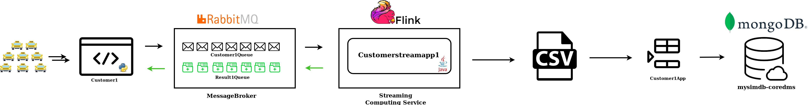
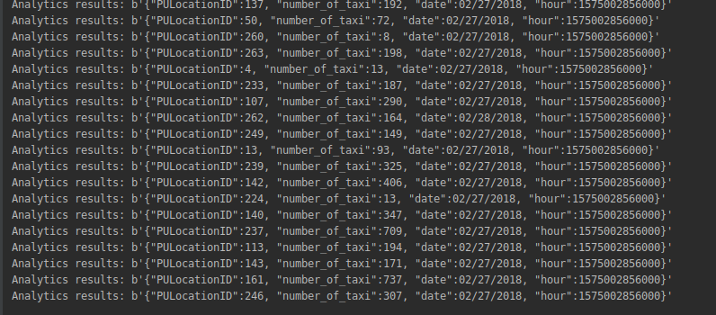
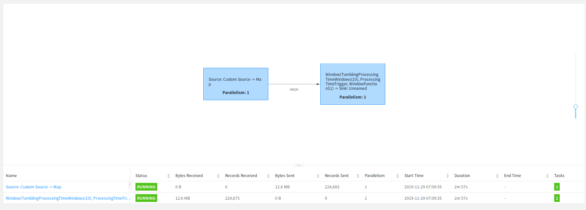
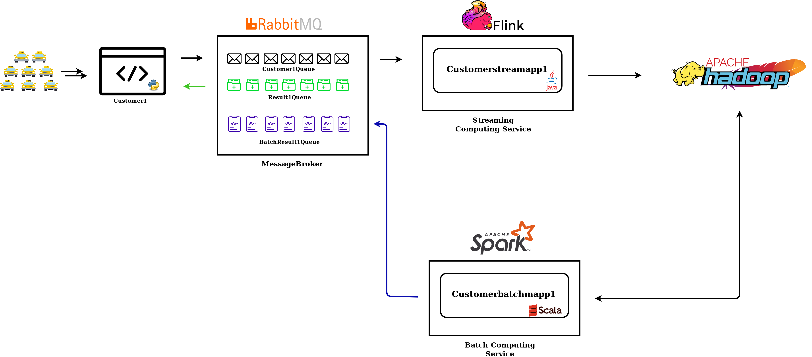
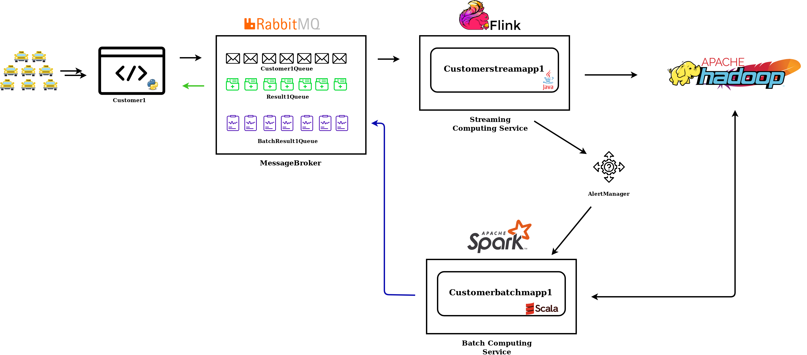

# Assignment 3 Report - Understanding Big Data Processing - 801979


## Part 1 - Design for streaming analytics
1. The selected dataset for this project is one the [NYC taxi Dataset](https://data.cityofnewyork.us/Transportation/2018-Yellow-Taxi-Trip-Data/t29m-gskq), it contains the yellow taxi trip records. The records are provided by two TPEP providers and they contain information about the time and the trip of the location as well as some additional information such as the tips amounts and the number of passengers. The main relevant fields for the analysis are: 
* The __tpep_pickup_datetime__, the date and time when the meter was engaged. 
* The __tpep_dropoff_datetime__, the date and time when the meter was disengaged.
* The __PULocationID__, TLC Taxi Zone in which the taximeter was engaged.
* The __DOLocationID__  TLC Taxi Zone in which the taximeter was disengaged.

    Some analytics has been defined for the customer:

i) Streaming analytics that, in a defined period, counts the number of taxies engaged in a specific taxi zone. Thus, the taxi provider knows where there is more request of taxis in a specific time, or a threshold can be set and when the number of taxis is greater than this threshold the taxi company can be warned, as a result, it can organize its taxi fleet accordingly. Another analytics can be done by counting the number of Group rides (Information that can be found inside __RateCodeID__) so that, in a specific amount of time. If the number of group trips is greater than usual the vendors can locate their "XL" Taxis.

ii) Batch analytics that, given the output from the streaming analytics can provide daily, weekly or monthly statistics to the vendors. For example, streaming analytics is agglomerating based on specific taxi areas the number of taxis that have been engaged per hour. Hence, the most frequented area per day can be calculated.


2\. The customer will send the data to the message broker which becomes the data stream source. The taxi record is sent simulating a stream as in a real case scenario:

i) The analytics is handled in keyed data streams, the records stream is keyed by __PULocationID__ dividing the data in different logical streams so that a tumbling window can be set. Furthermore, the keyed streams allow the computation to be performed in parallel in multiple tasks since each keyed stream can be processed independently. 

ii) In our use case, the analytics are estimated values, they do not need to be extremely precise as well as the scenario is not a critic one. So, it is not needed that the system check for missing messages. As a result, the selected delivery guarantee is  __at-most-once__ which means for each message handed to the system, that message is delivered zero or one times. This was also chosen since it has the highest performance and the least implementation overhead because it can be done without keeping states. On the other hand, __at-least-once__ and __exactly-once__ could be suitable and the connector supports them as well. However, as mentioned before, the application is not critic as well as the analytics is an estimated value, As a result, the exactly-once and the at-least-once guarantee are not necessary.

3\) 
In the original dataset, the time where the data are sent is a bit tricky since they are sent based on the arrival time as well as they can also be delayed since the record, in some case of connection issue, can be held in the vehicle memory before actually being sent to the vendor. As a result, the time that should be assigned to the sources is the __tpep_dropoff_datetime__ since it is when the event/record has been actually generated and sent to the specific vendor.

However, in order to simulate the streaming as well as to make the analytics more valuable for the customer, I assumed that the time associated with the streaming source is the processing time that refers to the system time of the __customerstreamapp__ that is executing the respective operation. The main problem in our analytic is that the analytic is done on some data generated at the pick-up time but the record is sent at the drop-off time. The difference between the two times consists of the time of the trip and it can vary record by record. The idea is to use the processing time combined with a tumbling time window with a certain size that guarantees to agglomerate enough data in the same window such that the analytics can be valuable for the customer as well as to avoid that the data will not be delivered in time to actually be used. The value selected for the time window is 1 hour. This means that, for example, if an application begins running at 9:15 am, the first hourly processing time window will include events processed between 9:15 am and 10:00 am, the next window will include events processed between 10:00 am and 11:00 am, and so on. 

An example is the following: the window start at 10:00 am and based on the __PULocationID__ the stream is keyed and it is split in different logical streams so at 11:00 am when the window is closed, the application can count the number of taxis that have been engaged for each taxi zone in that hour. Then the analytics are reported to the customer on which it can organize its taxi fleet.

4\)
The main performance metric in our case is the __throughput__ that calculates how many events can be processed per second. Thus, the goal is to maximize it. Pushing large amounts of data through the pipeline is crucial as the data rates grow.

To point out, given that a tumbling window is used as well as the analytics consist of agglomerating the input data. The latency is not a meaningful measure in our use case. For example, a record in input to the window can wait up to 1 hour to be actually processed. This is not a valuable measure of the processing time.

5\) Following a figure that represents the design of the architecture, limited to our  use case:

Figure: Basic schema of the implemented architecture


__Customer data source__, is the original case the data source is record generated by the NYC yellow taxis. As a result, streaming of messages is generated from the customer and pushed to the message broker. 

In the implementation, the streaming is simulated reading line by line a CSV file and a python producer ingest the message to the broker. 

__mysimbdp Message broker__, the message broker receives messages from the different customers, generates different queues where the customer application can listen to the messages. The broker is implemented as in the previous assignment using RabbitMQ. Specifically, it has been implemented as a Service using the CloudAMQP web service. This choice was made to speed up the implementation time.

__mysimdb Streaming computing service__, the tool selected to manage the streaming analytics is Apache Flink. This implies that the customers have to implement their __customerstreamingapp__ that works on top of Flink. Flink has been selected since it is made to deal with event data as well as it already provides different useful features: it provides a windowing system to use during the analytics as well as it manages itself parallelism. Furthermore, it has already implemented a connector with all the other technologies used in the architecture. 

__customerstreamapp__, these are all the applications that the customers can implement to do any kind of analytics on the respective data streaming. The __customerstreamapp__ along with __mysimdb Streaming computing service__ guarantee that after the analytics has been computed the results can be sent back to the message broker where the customer can get them listening to a different result queue. Besides, the streaming analytics results can be stored in a CSV file for future usages. Thus, the batch processing can be made on top of the streaming analytics results stored inside the data sink.

__mysqlcoredbms__, the data sink has been implemented using MongoDB Atlas. MongoDB Atlas provides a cloud solution where a cluster of 3 nodes have been created so that all the data are stored and replicated.

Finally, __customerIngestApp__ is an application provided by the customer that reads the results of the CSV file and ingests them into MongoDB.

A bit more about the customer side, on top of the __customerstreamapp__ and __customerIngestApp__ , it has to build a producer to ingest the messages to our message broker as well as it has to run a consumer application to read the result messages that are on the specific result queue. The last part could be provided by the architecture as well. It can be a web app where all the results of the customer are shown so that the customer can get insight directly from the web app and ask for the data if needed.

Furthermore, the architecture can be scaled in order to deal with multi-tenancy and each customer can have its data sources as well.

.png)
Figure that shows the architecture with multiple customers.

In order to store the analytics to the dataset, some concept and components designed and implemented in the previous assignment have been used. The concept is that the output streaming analytics is not directly stored inside the data sink before the analytics are stored inside CSV that is located in a staging directory. This is mainly done to reducing the number of calls to the data set.

The components that are re-utilized to implement the analytics ingestion are the following:

__Staging Data__  where the CSV files are located.

__BatchManager__ that forwards the CSV files to the correct customer batch ingestion app when needed.

__CustomerBatchIngestionApp__ that are app coded by the customer to store the analytics inside the data sink. They read the different CSV files, convert the data and ingest them to __mysqlcoredbms__.


## Part 2 - Implementation of streaming analytics
1. the structure of the input streaming data is formed by trip records including 17 different fields from the NYC yellow taxi trip: 
* VendorID
* tpep_pickup_datetime
* tpep_dropoff_datetime 
* passenger_count
* trip_distance
* RatecodeID
* store_and_fwd_flag
* PULocationID
* DOLocationID
* payment_type
* fare_amount
* extra 
* mta_tax
* tip_amount
* tolls_amount
* improvement_surcharge
* total_amount
A better explanation of each field is provided [here](https://data.cityofnewyork.us/api/views/t29m-gskq/files/89042b9b-8280-4339-bda2-d68f428a7499?download=true&filename=data_dictionary_trip_records_yellow.pdf)
In the simulation, the records are read form a CSV file and ingested to the message broker one by one. Then the __customerstreamapp__  read the messages from the specific queue. Each record before it has been sending to the message broker is shaped as string with commas dividing the different fields. Following an example of the message sent by the producer.
```
"1,02/27/2018 02:37:02 PM,02/27/2018 02:43:37 PM,1,1.1,1,N,161,234,1,6.5,0,0.5,2.15,0,0.3,9.45"
```
Moreover, during the queuing process, the data are serialized. Thus, the __customerstreamapp__ first has to deserialize them in order to recreate the different input fields of the report.

Once the entries have been deserialized, the analytics has been computed. The analytics, as said before, split the stream by __PULLocation__ using the key_bay as well as it filters out all the data that are not needed. Then, eventually, it computes the analytics and counts the number of records for each window.
The field kept and generated are the following:
* PULocationID
* number_of_taxi (The computed analytics)
* date ( date extracted form the tpep_pickup_datetime)
* hour ( computed hour ) 

The output has to be sent to the queue of the customer as well as it might be stored inside the data base. This time since the magnitude of the data sent is low I decided to send them as JSON file. A possible result can be the following:

```
{
    "PULocationID":"161"
    "number_of_taxi" : 2901
    "date" : 02/27/2018
    "hour" : 02:00
}
```

To sum up, the client has a producer that sends to the assigned queue records as massages (serialized) in string format (python RabbitMQ producer), the message broker queue the input, then the customerstreamapp (Java application) consumes the messages, it maps the string message in different field, it filters them then before process the data are serialized again. it processes them and eventually, it deserializes and sends back as JSON file the analytics to the result queue. Finally, a client consumer (python RabbitMQ consumer) read them. 

2\. The main logic for processing records inside __custoerstreamapp__ in the implementation is to split the stream in logical streams using the keyby feature provided by Flink based on the __PULLocation__ field, create a tumbling time window of 1 hour so that the data are grouped in chunks. Furthermore, the number of records for each chunks is calculated. 

   More precisely, the customerstreamapp receives messages from the message broker as string. First, it deserializes them as well as it filters out the data that are not needed for the analytics. Then the keyby(PULLocation) is applied. After that, the time window is generated fixing the time to 1 hour (during the testing phase the window time has been reduced). Finally, once the window was ready the data have been processed as follows: The PULocationID has been kept as original, the number_of_taxi has been calculated iterating along with all the records and count them. The date it has been extracted from the __tpep_pickup_datetime__ of the first entry. The hour has been set as the window end time. The hours have been generated in this way in order to speed up the implementation time but a more smart way to set them should be found if the batch analytics requires them.
 
   To conclude, the analytics are collected and sent back to the specific queue formatted as a JSON-like string.

3\. An example of the analytics are the following:

   
   Figure: Result printed by the customer1consumer

   Also, following a picture that represents the application working:

   
   Figure: Active customerstreamapp

   Testing environment:

   The environment is mainly composed of 4 components: the customer1producer, the message broker, the customerstreammapp1 and the customer1consumer. 

   Starting from the data source, the customer1producer read from a CSV file and ingest to the message broker the serialized records. The message broker, during the testing, was running locally. On the other hand, the deployment is made using the RabbitMQ as a Service using the CloudAMQP web service. The simulated customerstreamapp has been implemented using Java. During the test, an instance of Flink was running locally so that the custmerstreamapp could run on top of it. Once the analytics are computed and pushed back to the message broker, the customer1consumer read the results and print them. 

4\. The current implementation deal with wrong input inside the __custmerstreamapp__ implemented. It just checks if the message that it receives contains the same amount of field that the application actually expects. When the input is not as expected the records are not taken into account for the analytics, the application simply discard them. This can be reasonable since the analytics is an expected value so that results can be not strictly precise as well as the scenario is not critical. Besides, in the implemented architecture, the customers are responsible for the quality of the data. Right now the implemented check is just a basic control. To deal with this problem in the future some checks and exceptions can be implemented on both sides: from the customer as well as from the architecture.

5\.The parallelism is managed by Flink that natively supports multi-threading. The parallelism can be set directly from the customerstreamapp using the Flink feature __setParallelism()__ of the __DataStream__ class. Following the application running with 4 clusters:


Figure: Active Customerstreamapp with set parallelism to 4.

The application as tested with multiple parallelism and it has been shown that the higher the value the lower the performance. The perfect setting is 4. This can be easily explained since Flink was running locally, as a result, the resources of the CPU were limited to the 4-cores. This lead to the fact that in each core can be run only one stream a time. Hence, where the parallelism was set with higher values the performances were not decreasing. This is manually due to with higher values of parellelism the number of organization messages inside the cluster increase, thus, the overall performances decrease.

   To point out that some configuration need to be change to allow the parallelism.

## Part 3 - Connection
1. The figures in question 1.5) already show the analytics ingestion process. The main idea is to save the result from the __customerstreamapp__ to files CSV first, than when some file size is satisfied the files is forwarded to a customer ingestion application that read the csv file, process the data and ingest them in the final sink. This solution have been chosen since I think that as the customer was already taking caring of the analytics part implementing the __customerstreamapp__, it should be also on him the analytic ingestion app implementation. 

    More implementation detail: the __customerstreamapp__ should know the location of the staging directory. Once the data are in the staging directory, the manager will forward them to the relative client application. The manager implementation consist as a python script that each 30 second fetch the staging directory and based on the file  size decide whether to forward or not the input files to the respective customers ingestion applications. The routing can be managed using a configuration file.

2. Following the architecture to implement the batch analytics. (The architecture is simplify taking into account only one customer)

    
    Figure: the architecture with the batch analytics process. 
    
    The batch analytics selected consists to analyse the streaming output and compute some historical analytics based on the date field present inside the records. To some up the output of the streaming analytics, it consist in the total number of taxi engaged in a specific taxi zone each hour. As a result, for each our of the day, we know which zone was the most "crowded" (where more taxi were engaged). In addition, in each record we have also the date that it can be used to additional processing, such that, the most profitable zone for each day or for each month. 

   In order to perform the batch analytics, first I would consider to use HDFS instead of MongoDB as data sink. As a consequence, Spark can be used to perform the batch analytics since, together, they can offer powerful capabilities for writing simple code that can quickly compute over large amounts of data in parallel. Besides, HDFS is also highly compatible with Flink.

3. Following the design to tackle the critical condition. (The architecture is simplify taking into account only one customer)

    
    Figure: the architecture design to takle the critical condition 
    
    When the __customerstreamapp__  detects a critical condition, it can run the Allert Manager that automatically start the batch analytics triggering the appropriate __customerbatchapp__. The __customerbatchapp__ can read the necessary data from HDFS, process them and send the results to an apposite queue on the message broker as well as to store them inside the data sink if necessary.
    
4. The second figure in the question 1.5) show a possible design of the architecture with multiple customer. As a result, the current architecture can already manage multiple customer and different data sources. For multiple customer, multiple client app will be needed.

    To think big, in order to optimize the architecture and increase the performance, the main techniques that I think is more suitable is to the horizontal scaling of some components, First I would scale the message broker so that the ingested message flow can be divided in different instances of RubbitMQ, in order to do that, I would use containerization through Docker to deploy the message broker such that based on some metrics such as the throughput instances of the broker can be launched or killed. To menage this organization a container orchestrator such as Kubernetes is needed. Furthermore, by design Flink is highly optimized and it can already manage the scale out of the system.

5. As I already said in question 1.2 that in the use case it is enough to have a __at-least-once__ delivery guarantee. However, with the current architecture is already possible to reach an __ecxactly-once__  delivery guarantees.

    This it is possible since the technology selected to implement the message broker (RabbitMQ) as well as the technology used to implement the streaming computing service (Flink) offer acknowledgement mechanism functions to implement. 
    
    To implement an exactly-once guarantee, according to the [official documentation of the flink RabbitMQ Connector](https://ci.apache.org/projects/flink/flink-docs-stable/dev/connectors/rabbitmq.html) the following steps are required: first, the __Enable checkpoints__ has to be enabled, this imply that the messages are only removed from the RabbitMQ queue when checkpoint are completed. Second, __Correlation IDs__ have to be used. They are RabbitMQ application features. The correlation id is used by the source to deduplicate any messages that have been reprocessed when restoring from a checkpoint. Finally, __Non-parallel source__ are allowed. The source must be non-parallel (parallelism set to 1) in order to achieve exactly-once. This limitation is mainly due to RabbitMQ’s approach to dispatching messages from a single queue to multiple consumers.
    
    In order to guarantee an __end-to-end exactly-once__ delivery, eventually the customer should respect the constraint set by the message brokers as well. 
